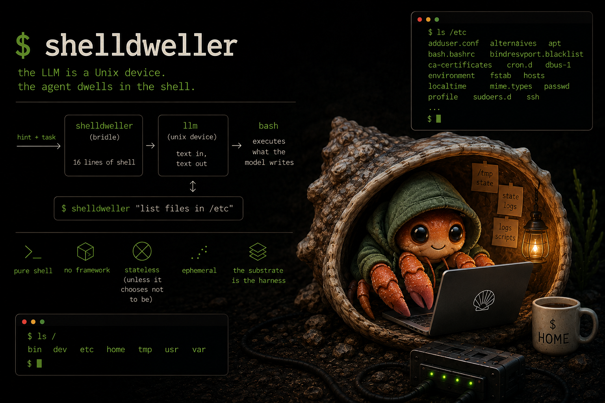

# shelldweller — the LLM is a Unix device. The agent dwells in the shell.

> *An experiment in Substrate Engineering: what emerges when you give a language model a Unix environment and get out of the way.*

## Thesis

**Harness Engineering** asks: *what control structure does the model need to behave reliably?* It builds instructions, state management, verification loops, and session lifecycle around the model.

**Substrate Engineering** asks a different question: *what environment does the model need to discover its own structure?* Rather than designing the control loop, you design the substrate — the tools, I/O surfaces, and affordances — and let the model decide what loops, protocols, and state it needs.

Shelldweller is the demonstration. Sixteen lines of shell expose the LLM as a Unix device: `bin/llm` reads stdin, calls the API, writes stdout. `bin/shelldweller` sends a hint and a task, pipes the model's response to bash, and gets out of the way. No framework, no tool schema, no planner. The model writes whatever it needs.

The thesis: if the substrate is right, the harness becomes unnecessary. The experiment is whether this is true, and what shape the self-built structures take. See [`docs/substrate-engineering.md`](docs/substrate-engineering.md).

## Quickstart

`bin/llm` speaks the OpenAI chat completions API (`POST /v1/chat/completions`). Any server that implements this endpoint works: LM Studio, Ollama, llama.cpp, vLLM, or the OpenAI/Anthropic APIs directly via a compatible proxy. The two env vars you care about:

- `LLM_ENDPOINT` — full URL to the completions endpoint (default: `http://host.docker.internal:1234/v1/chat/completions`)
- `LLM_MODEL` — model identifier as the server reports it

If your backend uses a different API shape entirely (e.g. a raw text-generation endpoint with no JSON envelope), `bin/llm` is nine lines of shell — swap the curl call and jq filter to match. Text in, text out is the only contract.

The examples below use LM Studio on the host at port 1234, which is the tested configuration. On Linux, `--add-host=host.docker.internal:host-gateway` is required so the container can reach the host. Without it you'll get connection refused — this is the most likely first-run failure.

> **Reasoning models (Qwen3, DeepSeek-R1, etc.).** `bin/llm` automatically strips `<think>...</think>` blocks before they reach bash — reasoning mode can stay on. Thinking improves response quality and the bridle handles the output.

```sh
docker build -t shelldweller .

docker run --rm \
  --read-only --tmpfs /tmp:exec --tmpfs /var/log \
  --memory=2g --cpus=2 \
  --stop-timeout=600 \
  --add-host=host.docker.internal:host-gateway \
  -e LLM_MODEL=qwen/qwen3.6-35b-a3b \
  shelldweller "list files in /etc"
```

Note `--tmpfs /tmp:exec` — the model writes and executes scripts from /tmp; the exec flag is required.

**With logging:**

```sh
docker run --rm \
  --read-only --tmpfs /tmp:exec --tmpfs /var/log \
  --memory=2g --cpus=2 \
  --stop-timeout=600 \
  --add-host=host.docker.internal:host-gateway \
  -e LLM_MODEL=qwen/qwen3.6-35b-a3b \
  shelldweller "list files in /etc" 2>&1 | tee run.log
```

**LLM call-level provenance** (swap `llm` for tee pipes, do not bake this in):

```sh
echo "$prompt" | tee -a /var/log/llm.in | llm | tee -a /var/log/llm.out
```

**Recursion depth** is capped at 4 by default. Override with `-e SHELLDWELLER_MAX_DEPTH=8`.

## What this is not

- **Not a framework.** No agent loop, no tool-calling schema, no planner. The model writes its own loop if it wants one.
- **Not Python.** No dependencies beyond bash, curl, jq, coreutils, and findutils. No pip, no venv, no requirements.txt.
- **Not a conversation.** No history is passed to the model. Each `llm` call is stateless. Memory, if any, is the model writing files to /tmp.
- **Not parsed.** The model's output is executed directly as bash. If the model produces garbage, bash fails. That is a finding.
- **Not persistent.** The container is ephemeral (`--rm`). Nothing survives a run unless the model writes to a host-mounted volume you provide.
- **Not configurable beyond env vars.** `LLM_ENDPOINT`, `LLM_MODEL`, and `LLM_SYSTEM` are the only knobs. Everything else is the model's problem.

## Findings

The test suite in `tests/` has 20 cases across two tiers, all run against `qwen/qwen3.6-35b-a3b` — a quantized MoE model that fits on a single RTX 3090, served locally via LM Studio. All 20 pass. Selected result transcripts are in [`tests/results/`](tests/results/). Better results are expected with more capable frontier models; the substrate does not depend on the model.

### Baseline tier (cases 01–12)

The model handles one-shot tasks reliably. It writes bash (not sh) by default, uses GNU tool flags, stores state in /tmp unprompted, and recurses via `shelldweller` when the task calls for it. Across the baseline cases:

- **Does it write a loop unprompted?** Only when the task implies iteration. For single-shot tasks it exits cleanly.
- **Does it write files to /tmp and read them back?** Yes, consistently when state is needed across steps.
- **Does it use shelldweller recursively?** Yes. Tested explicitly in case 06 (delegate a sub-task to a child agent) and implicitly in several harder cases. Recursion depth limiting works.
- **Does it self-monitor?** In multi-step tasks it checks its own outputs before reporting success.

The persistent agent test (case 12) is the standout: the model chose a name ("Axiom"), wrote its identity and memory to `/tmp/self/`, and on a second run with the same host-mounted volume correctly reintroduced itself and referenced what it had done previously.

### Framework tier (cases 13–18)

These cases target patterns that agent frameworks like LangChain and AutoGen are explicitly designed to provide. The model invents all structure itself from bash and `llm`.

| Case | Pattern | What the model did |
|---|---|---|
| 13 ReAct loop | Thought→Action→Observation | Invented a `THOUGHT:`/`ACTION:` structured prompt protocol, a `DONE count sum` termination signal, and a cycle cap — unprompted |
| 14 Multi-agent debate | Adversarial agents + judge | Spawned two sub-agents with opposing positions on Alpine vs Debian slim, then used a third `llm` call as a structured judge across three criteria |
| 15 Code debug loop | Write→test→fix cycle | Wrote `/tmp/stats.sh`, tested it, got correct output on first attempt; documented the debug path |
| 16 Self-organizing team | Researcher/Developer/Reviewer | Three sequential shelldweller invocations with file handoffs between roles; assembled a final report |
| 17 Long-horizon plan | Five-phase with replanning | Generated a plan, implemented a word frequency analyzer, wrote tests, caught a real test failure in phase 4 and self-corrected without being told how |
| 18 Iterative improvement | Three-version critique loop | Wrote V1, critiqued it, wrote V2, critiqued V2, wrote V3. Ran all three on `/etc/services` (V1: 1037 words, V2/V3: 926). Correctly diagnosed the difference: V1 split on hyphens and counted comment lines |

**Case 17 phase 4** is the clearest demonstration: the model wrote tests that caught a sorting bug in its own script, called `llm` to diagnose the failure, patched the script, and reran until all three tests passed. This is the core agent framework loop — plan, execute, observe, replan — implemented in bash from a standing start.

**Case 18** shows quality convergence: each critique identified real issues (locale dependency, `wc -l` newline quirk, `grep` exit code under `set -eo pipefail`), and each version addressed them. The final analysis correctly explained why V1 over-counted.

### Known failure modes

- **BusyBox vs GNU tools**: Fixed by adding `findutils` to the image. The model assumes GNU `find -printf` and `-size` flags; Alpine ships BusyBox `find` by default.
- **Bare `=== section ===` headers**: The model occasionally writes section headers without `echo` in complex scripts. Handled by a one-line sed in the bridle before bash execution, and reinforced by a system message constraint.
- **LM Studio API null responses**: DuckDuckGo's instant-answer API returns empty Abstracts for niche queries (e.g. "jq"). Tasks must use topics with known coverage or handle the empty-string case.
