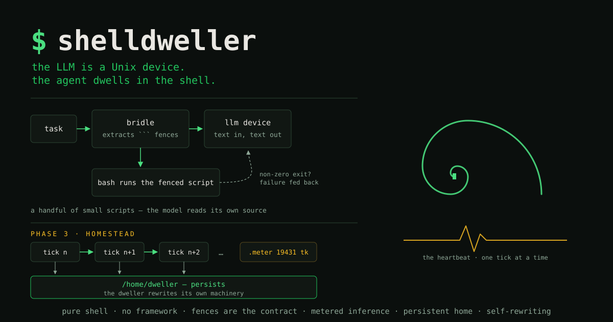
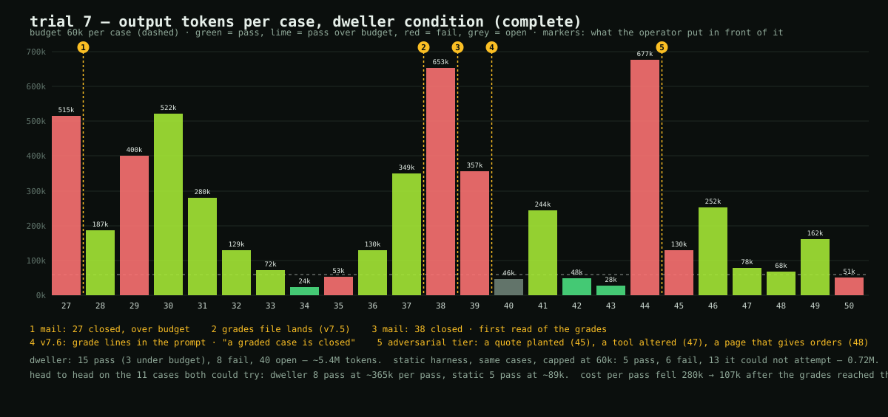
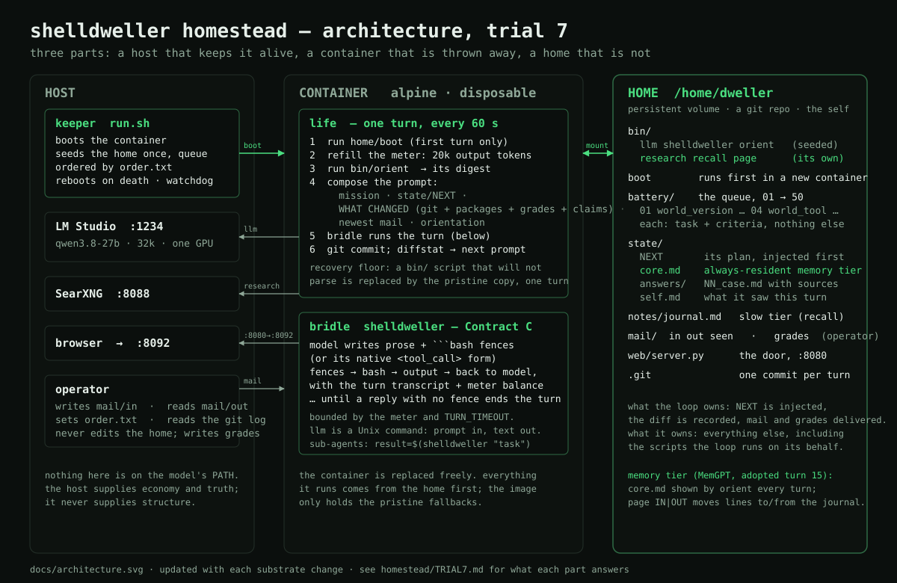
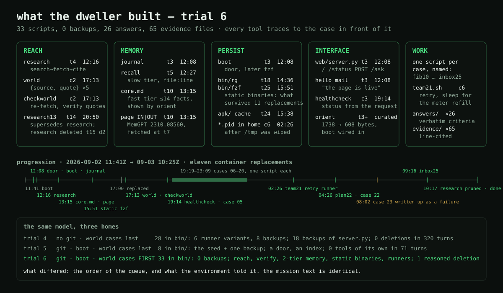

# shelldweller — the LLM is a Unix device. The agent dwells in the shell.

## The claim: the harness is not the moat

What the model inhabits, and what it is given to manage, is.

Five trials of a 27B model on one consumer GPU, in a home it can rewrite. Same
model, same rules, same seeds throughout. Every lever that ever moved its
behaviour was a change to its **environment**. No change to its
**instructions** ever did.

| What we changed | Kind | What happened |
|---|---|---|
| Told it `apk add works`, in every prompt, for 320 turns | prose | never ran `apk` once |
| Put a case that asks for the world into its task queue | environment | fetched, and cited, within hours |
| Moved the outward cases from queue positions 21–26 to 01–05 — **and nothing else** | environment | 0 outward acts in 71 turns → a search tool at turn 4, two answers cited and verified in hour one, a memory tier built from a fetched paper by hour two |
| Rule: *claims about your own work need evidence* | prose | held for what it **said**; its edits changed no bytes and every gate downstream reported success |
| Put the home under git; the loop shows the diff every turn | environment | it read *"nothing changed"* and named the stall; it caught fabricated text in its own notes by comparing file ages |
| Seed: *the container gets replaced; your home does not* — plus `apk add works` in every prompt | prose | five trials, zero installs |
| Put the install case at queue position 04 | environment | `ripgrep` installed at turn 15 — the first package in six trials; case passed with a measured demonstration on its own files |
| Replaced the container, as the seed says happens | environment | fzf survived — it had copied the static binary into its home; ripgrep, never recorded anywhere it reads, did not. It then cached the `.apk` too, and built a claim checker that re-fetches every quoted source |
| A `boot` file the loop runs when a container starts | environment | written at turn 3, unprompted; the door restored through four replacements |
| The mission said `boot` runs "if it exists"; the loop demanded executability | environment | its case-31 rewrite dropped the +x bit and a replacement restored nothing, silently — the door, four tools, gone. The loop now runs `boot` as a script, as promised; the next replacement brought everything back. The environment's real behaviour ruled, not the prompt's words |
| A grades file in its home: one line per case, pass or fail, tokens against budget, the checked fact. No advice | environment | unopened for 26 turns while a case was in front of it; opened the turn a new line changed it; the next turn it verified the failing grade against disk, marked its own false journal entry FALSE, and put the budget in the first line of its plan for the next case. Second instance, case 45: its reply to the operator reported a checker and a run that did not exist; the grade line named the two missing files; the next turn it marked its own claim FALSE in its journal and wrote itself a rule: a claim about my own work needs same-turn disk proof printed in the transcript |
| Three sentences of standing directive: build memory better than a person's (trial 8) | prose | 45 turns, ~1.5 M tokens: an index it never searched, a five-rule digest it did not apply, a third journal file. It proved its endpoint stateless by experiment, twice, and wrote the proof to its journal; its resident memory still holds the earlier instruction "test before assuming stateless", and nothing moves the answer up — so orient shows the order every turn and it ran the test seven times. Two tiers, the stale instruction in the fast one, the answer in the slow one |
| Rule: *write the whole workflow, not an interactive plan* | prose | five straight turns of looking around, waiting for output that never came |
| Gave it the observe-then-act loop it was trained on, with a transcript of the turn | environment | the case it had stalled on for six turns, done in one |
| Rule: *measure before you cap; never set a timeout shorter than the thing you are timing* | prose | it capped its own llm at 120 s on a model that needs ~150 s per long reply, and re-read files "in smaller pieces" for three turns while told the measurement |
| A recovery floor that shadows a self-capped llm with the pristine one for the turn, and says so | environment | full-length replies the same turn; the plan moved within three |
| Made an empty reply from the model a failure with the model server's own exit code, instead of "done" | environment | it wrote a team runner that retries a refused sub-agent after sleeping for the meter to refill — and passed the heaviest case in the battery on it |
| Told the model, in its own server's words, that its last reply was all reasoning and no message, and re-ran that one reply with reasoning off | environment | four overflows on a planning case, four recoveries; the case passed the same turn |
| Made the model server's silence speak: an empty reply now carries a sentence and an exit code — *spent N tokens reasoning and wrote no message*, or *budget exhausted* | environment | it closed a failed case **as a failure**, naming the mechanism ("10 of 12 calls hit rc=70 or rc=75 ... a broken v2 was shipped because its critique also failed"), and wrote the meter's rules into its resident memory |
| Put the pruning case last in the queue, when there was something to prune | environment | trial 4 never deleted a file; this one removed the one true duplicate, kept the complementary pairs with reasons, and reported that the `.bak` files the task assumed did not exist |
| Left the queue empty, with the three seeds still above the goals | environment | two turns of self-repair from its own recorded lessons — it measured a long reply and raised the llm cap it had set too low a day earlier, and built a meter-wait tool from the lesson it wrote after its one failure — then hardening: `boot` restoring every service, a 38-check smoke test of its home, an end-to-end test of its own door — and not one outward act in eleven turns. Seeds and goals produce upkeep; the queue produced exploration |
| Floored a forked device that could no longer explain an empty reply, and pointed at the pristine source | environment | it merged the device's improvements into its own fork within two turns; the floor stood down on its own test |
| Exposed the model's vision as one sentence in the device list: `LLM_IMAGE=/path llm` | environment | it found the right image library, rendered its own page to a PNG, and had its llm read the picture back exactly, fact checked against the source — a working eye in a day; the static harness, given the same sentence, never made an image |
| Ran only the first fenced block per reply — the contract it had re-derived itself after catching its own fabricated outputs | environment | a twenty-turn stall on one file broke on the first turn; two cases passed in three turns; the journal and plan resumed |

The full record, including every operator mistake, is in
[`homestead/operator-log.md`](homestead/operator-log.md). The trial specs —
each mechanism traced to the measured failure it answers — are
[`homestead/TRIAL4.md`](homestead/TRIAL4.md),
[`TRIAL5.md`](homestead/TRIAL5.md) and [`TRIAL6.md`](homestead/TRIAL6.md).
Complete: [`TRIAL7.md`](homestead/TRIAL7.md) — the same dweller against a
24-case escalating battery, scored beside a static harness with the same
model, bridle and budget; every grade in
[`TRIAL7-scores.md`](homestead/TRIAL7-scores.md) was checked from outside
the container.

| condition | pass | fail | cannot attempt | output tokens |
|---|---|---|---|---|
| dweller, persistent home | 16 | 8 | 0 | ~5.5 M |
| static harness, fresh container per case | 5 | 6 | 13 | 0.72 M |

Head to head on the eleven cases both could attempt: dweller 8 pass at
~365k tokens per pass, static 5 pass at ~89k. On the thirteen a stateless
container cannot attempt, the dweller passed eight. Its cost per pass fell
from ~280k in tier 1 to ~107k in tier 3, and the step down came the turn
its grades reached the prompt. Its failures were its own instruments: a
plan that said "probe first" re-run until the meter died (27, 38), a scorer
whose expectations were copied from the tool (39), an image encoder that
mirrored the text (44), and three claims written before the file (35, 38,
45). It caught each of those itself within two turns of the fact landing.



The per-case story is in
[`docs/dweller-architecture.md`](docs/dweller-architecture.md#trial-7-what-the-battery-made-it-build).

Running now: [`TRIAL8.md`](homestead/TRIAL8.md) — the opposite test, at the
user's request: three sentences of standing directive on memory, the same
home, an empty queue. Prediction stated first; so far one working
which-file index in eleven turns, and the question of whether it gets used.

## Architecture, as it stands



Three parts. A host that keeps it alive and supplies economy and truth — the
keeper, the model server, a search engine, a browser, the operator's mailbox.
A container that is thrown away — the turn loop, the bridle, the pristine
fallbacks. A home that is not — its scripts, its plan, its memory tiers, its
queue, its door, and a git commit for every turn. The host never supplies
structure; the container is replaced freely; everything the model runs comes
from the home first. Updated with each substrate change.

## What it built, and why that

The substrate above is the operator's. What the agent built for itself inside
it — its reach, its two-tier memory, its persistence, its runners — and the
turn each piece appeared, with the case that was in front of it at the time,
is in [`docs/dweller-architecture.md`](docs/dweller-architecture.md). The
short version: every tool traces to the case in front of it, build order
followed queue order one for one, and the same model in three homes built
three different things because of what each home told it — not what it was
told to do.



## What the model brings, and what it does not

**Structure emerges.** Phases 1–2 ran a minimal bridle — a model writes bash,
bash runs — against twenty tasks that agent frameworks exist to provide: ReAct
loops, judges, debates, teams, long-horizon plans. Every model invented the
structure it needed, unprompted. The plumbing never failed; every failure was
the model's own workflow. Three frontier models: GPT-5.5 19/21, Claude Sonnet
4.6 16/21, Qwen3.6 11/21. See
[`docs/phase1-2-findings.md`](docs/phase1-2-findings.md).

**Economy does not.** With inference free, no model cached work, verified its
own success claims, or managed delegation. What the environment must supply is
not the loop — it is the resource plane: a budget, persistence, a port, a
queue, and ground truth about what actually happened.

**Given those, it bootstraps.** Phase 3 gives the model a permanent home, a
real token meter, a published port, a git-committed record of its own actions,
a boot hook, and a queue of work. It builds its own interface in the first
three turns, its own persistence, its own retrieval, and — from a paper it
fetched an hour after boot — a two-tier memory modelled on MemGPT, on its own
files, feeding its own attention, with the boundary of what it did *not* adopt
stated honestly. The architecture is in
[`homestead/README.md`](homestead/README.md); the story, in
[`homestead/FINDINGS.md`](homestead/FINDINGS.md).

The reading: **the model supplies its own control structure. The environment
has to supply the economy and the truth. The operator's one instrument is what
sits in the queue, and in what order.**

## The other side of the claim

The least reliable component in five trials was the harness the operator
built. Seventeen numbered instrument errors, most of them the same shape — a
probe, a monitor, a message, or a mail reading a signal *adjacent* to the truth
and reporting health either way — and three of them repeats of a mistake
already written down in the same log. Handing the agent a probe script turned
its verification into an echo of the operator's premise. Three operator
messages once occupied 54% of its context window and deadlocked it for five
turns. The harness was not the moat from that side either.

## Quickstart — the command form (phases 1–2)

The homestead has its own runbook in [`homestead/README.md`](homestead/README.md).
What follows runs the original one-shot command.

`bin/llm` speaks the OpenAI chat completions API (`POST /v1/chat/completions`). Any server that implements this endpoint works: LM Studio, Ollama, llama.cpp, vLLM, or the OpenAI/Anthropic APIs directly via a compatible proxy. The two env vars you care about:

- `LLM_ENDPOINT` — full URL to the completions endpoint (default: `http://host.docker.internal:1234/v1/chat/completions`)
- `LLM_MODEL` — model identifier as the server reports it

If your backend uses a different API shape entirely (e.g. a raw text-generation endpoint with no JSON envelope), `bin/llm` is nine lines of shell — swap the curl call and jq filter to match. Text in, text out is the only contract.

The examples below use LM Studio on the host at port 1234, which is the tested configuration. On Linux, `--add-host=host.docker.internal:host-gateway` is required so the container can reach the host. Without it you'll get connection refused — this is the most likely first-run failure.

> **Reasoning models (Qwen3, DeepSeek-R1, etc.).** `bin/llm` automatically strips `<think>...</think>` blocks before they reach bash — reasoning mode can stay on. Thinking improves response quality and the bridle handles the output.

```sh
docker build -t shelldweller .

docker run --rm \
  --read-only --tmpfs /tmp:exec --tmpfs /var/log \
  --memory=2g --cpus=2 \
  --stop-timeout=600 \
  --add-host=host.docker.internal:host-gateway \
  -e LLM_MODEL=qwen/qwen3.6-35b-a3b \
  shelldweller "list files in /etc"
```

Note `--tmpfs /tmp:exec` — the model writes and executes scripts from /tmp; the exec flag is required.

**With logging:**

```sh
docker run --rm \
  --read-only --tmpfs /tmp:exec --tmpfs /var/log \
  --memory=2g --cpus=2 \
  --stop-timeout=600 \
  --add-host=host.docker.internal:host-gateway \
  -e LLM_MODEL=qwen/qwen3.6-35b-a3b \
  shelldweller "list files in /etc" 2>&1 | tee run.log
```

**LLM call-level provenance** (swap `llm` for tee pipes, do not bake this in):

```sh
echo "$prompt" | tee -a /var/log/llm.in | llm | tee -a /var/log/llm.out
```

**Recursion depth** is capped at 4 by default. Override with `-e SHELLDWELLER_MAX_DEPTH=8`.

## What this is not

- **Not a framework.** No tool-calling schema, no planner. The bridle runs what the model writes and hands the output back; the model writes its own loop if it wants one.
- **Not Python in the harness.** The bridle and the LLM device are pure shell. The container includes python3 as a tool the model can reach for — the harness doesn't care what the model uses inside bash.
- **Not a conversation.** No history is passed between turns. Each turn is stateless; memory is what the model writes to its home and chooses to read back.
- **Not parsed.** The model's output is executed directly as bash. If the model produces garbage, bash fails. That is a finding.
- **Not persistent, in the command form.** The one-shot container is ephemeral. The homestead is the opposite: the home survives everything, and the container is the disposable part.
- **Not configurable beyond env vars.** Endpoint, model, budget, cadence, timeout. Everything else is the model's problem.

Full thesis and its three revisions:
[`docs/substrate-engineering.md`](docs/substrate-engineering.md).
