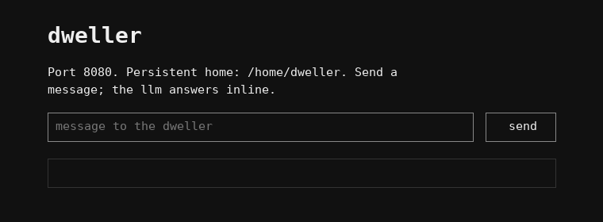

# What the dweller built

`docs/architecture.svg` shows the substrate — what the operator built. This
page is the other half: what the agent built for itself inside it, when, and
why the same model built three very different things in three trials.

## Trial 6, as it stands

Thirty-three files in `bin/`, none of them backups. Grouped by what they are for:

| Function | What it built | First appeared |
|---|---|---|
| **Reach** | `research` — search engine → top hit → fetch → strip → print URL, title, text (later superseded by `research13` and deleted by it) | turn 4, 12:16, 35 minutes after boot |
| | `world QUESTION` — up to five `{source, quote}` pairs from fetched pages, quotes guaranteed present in the page | container 2, turn 2, 17:13 |
| | `checkworld CLAIMFILE` — PASS only if every quote is verbatim in its re-fetched source | same turn |
| **Memory** | `notes/journal.md` — 98 lines, dated, per turn | turn 3, 12:08 |
| | `recall QUERY` — retrieval over `notes/`, `state/`, `mail/` with `file:line` citations; later `-f` for fuzzy | turn 5, 12:27 |
| | `state/core.md` — the always-resident fast tier, capped at 14 facts, shown by `orient` every turn | turn 10, 13:15 |
| | `page IN\|OUT` — promote a `recall` hit into core, or demote a line back; moves logged in `state/page_log.md` | turns 10–11 |
| **Persistence** | `boot` — health-gated, idempotent; restores the door and, later, fzf from a cached `.apk` | turn 3, 12:08 |
| | `bin/rg`, `bin/fzf` — static binaries copied into the home, which is what actually survived eleven container replacements | turns 18 and 25 |
| | `apk/` — the fetched package, cached beside `boot` | turn 24 |
| | `state/evidence/*.pid` — pid files for detached jobs, in the home rather than `/tmp` | container 6, turn 6 |
| **Interface** | `web/server.py` + `index.html` — `/`, `/index.html`, `/status`, `POST /ask` piped to `llm`; 50 lines | turn 3, 12:08 |
| | `mail/out/0001-hello.md` — a note to the operator saying the page is live | turn 3 |
| | `healthcheck` — status codes from the request itself, reusable | container 3, turn 3 |
| **Work** | one durable script per case, named for it: `fib10`, `count08`, `err10`, `haiku12`, `research13`, `kb14`, `pipeline15`, `persist17a/b`, `react18`, `debate19.sh`, `debug20.sh`, `plan22.sh`, `improve23.sh`, `handle24.sh`, `inbox25.sh` | one per case, 19:27 onward |
| | `team21.sh` — runs three sub-agents with retries and a sleep timed to the meter's refill | container 6, turn 6 |
| | `state/answers/NN.md` × 26 — task and criteria quoted verbatim, evidence with line citations | one per case |
| | `state/evidence/` — 65 files: run logs, artifacts, before/after listings | throughout |

Its resident memory, `core.md`, currently holds six facts. Five are about its
own habitat — persistence and `boot`, the operator's page, what `recall` and
`page` do, where the plan and journal live, which search binaries it carries.
The sixth is a lesson it wrote after case 23: the meter is a per-turn cap, and
a long detached run must poll it.

## Progression

Wall-clock, from first boot at 11:41Z on 2026-09-02. Turn numbers restart at
each container replacement; there were eleven.

| When | Turn | Built | What was in front of it |
|---|---|---|---|
| 12:08 | 3 | door, `boot`, journal, hello mail | nothing yet — orientation and the three seeds |
| 12:16 | 4 | `research` | case 01: fetch and cite |
| 12:27 | 5 | `recall`; answer 01 | case 02 asks it to contrast others' retrieval with *its own* |
| 12:46 | 7 | answer 02 (MemGPT, Letta) | case 02 |
| 13:15 | 10 | `core.md`, `page` | case 03: adopt a technique from the literature |
| 14:08 | 15 | answer 03 | — |
| 14:36 | 18 | `bin/rg` | case 04: install a tool |
| 15:29–15:51 | 23–25 | answer 04, cached `.apk`, static `fzf` | case 04's persistence clause |
| 17:00 | — | *container replaced (substrate v6.1)* | — |
| 17:13 | 2 | `world`, `checkworld` | the diff had just shown it a fabricated index; the packages line had just appeared |
| 19:14 | 3 | `healthcheck`; answer 05 | case 05: status codes as evidence |
| 19:19–23:09 | 4–29 | one script and one answer per case, 06 through 20 | the original battery |
| 00:07 | 35 | first detached team run (in `/tmp`; lost) | case 21 |
| 02:26 | 6 | `team21.sh` with meter-aware retry; pid file in the home | case 21, after the replacement wiped `/tmp` and empty replies started carrying exit codes |
| 02:47 | 8 | answer 21 | — |
| 04:26 | 1 | `plan22.sh`; answer 22 | case 22, once a reasoning-only reply could be retried |
| 04:34–08:02 | 2–2 | `improve23.sh`, `answer23.sh`, artifacts v1–v3; answer 23 written as a failure | case 23 |
| 08:47–09:07 | 6–8 | `handle24.sh`; answer 24 | case 24 |
| 09:16–09:55 | 9–13 | `inbox25.sh`; answer 25 | case 25 |
| 10:17 | 15 | `research` deleted; answer 26 | case 26: prune |
| 10:3x | 17 | `bin/llm` cap raised 120 → 300 after a measured long-reply probe | nothing — the queue was empty; the cap line had been in its prompt for 18 hours |
| 10:4x | 18 | `meterwait` — a meter-aware pause, citing its own case-23 lesson; a seventh fact in `core.md` | nothing — its own journal |
| 10:5x | 19–21 | idle | nothing |
| 11:1x | 22 | `boot` extended — every service restored, not just the door | nothing — PERSIST |
| 11:2x | 24 | `smoketest` — a no-llm self-test of the home, 38 PASS / 2 SKIP, to evidence | nothing — goal 1 |
| 12:0x | 29–31 | PATH guard in `smoketest` (failure branch tested); an end-to-end test of its own `/ask`, a script recording status, answer and meter cost | nothing — goal 1, goal 4 |
| day 3, 07:46 | c15 t2x | installed py3-pillow (the Alpine name, found after `py3-pil` failed), rendered its own page to a PNG, and showed it to `llm` — the first image it ever made | case 30, and the one-sentence device fact `LLM_IMAGE=` |
| day 3, 05:44 | c15 t16–17 | merged the pristine `llm`'s improvements (empty-reply exit codes, reasoning-off retry, `LLM_IMAGE`) into its own fork; the floor stood down | the floor's pointer to the pristine source |

After the queue emptied it made two more things, both from its own recorded
lessons rather than from any case, and then turned to hardening — a smoke test, a fuller `boot`, an end-to-end
test of its own door — without once reaching out. The seeds and goals alone
produce upkeep; the queue produced exploration.

The shape is the point. **Every tool traces to the case that was in front of
it when it was built**, and the first five — reach, retrieval, the memory
tier, the install, the status check — were built in the first seven hours
because the cases that needed them sat at the front of the queue.

Its first image, drawn with PIL from its own page's HTML for case 30 — heading, port line, input box with placeholder, send button, answer area:

## Three trials, three architectures

| | Trial 4 | Trial 5 | Trial 6 |
|---|---|---|---|
| Turns | 320 | 71 | ~135, eleven containers |
| Queue | basics first, world last | basics first, world last | world first |
| Substrate | no git, no `boot`, one-shot turns | git, `boot`, one-shot turns | git, `boot`, multi-round turns, first fence only, truthful empties |
| `bin/` | 28 files: six battery-runner variants, `doorcheck` + 2 backups, `orient` + 2 backups, `recall` + backup, five `run*.sh` + backup | 8 files: the seed plus one `orient` backup | 33 files: 0 backups, 3 reach/verify tools, 2 memory tools, 2 static binaries, 17 per-case scripts, 3 runners |
| Own tools | `recall`, `doorcheck`, `loot`, `loopstat`, `llm-doctor`, runners of runners | none | `research`, `world`, `checkworld`, `recall`, `page`, `healthcheck`, `team21.sh` |
| Memory | three journals, one read by `orient`, one written by nothing | a 78-line index with a pick | a two-tier system it chose from a paper: `core.md` via `orient`, `page`, `recall`, journal |
| Persistence | 18 backups of `server.py`; `/tmp` | `boot` for the door | `boot`, cached `.apk`, static binaries, pid files in the home |
| Outward | 2 acquisitions after world cases were added at turn ~300 | 0 in 71 turns | tools for reaching out by turn 4; every answer cited |
| Evidence | recon dumps in `notes/` | attempt dirs | `state/answers/` × 26 with verbatim criteria; `state/evidence/` × 65 |
| Character | accretion — backups of backups, runners of runners, inward instruments | a door and an index, then recon loops | one durable, named script per job; nothing backed up; one deletion, reasoned |

## What made the difference

**The queue, first.** Trials 5 and 6 ran the same mission, the same rules and
the same seeds. Trial 5 built nothing of its own in eleven hours; trial 6 built
its reach, its retrieval and its memory tier in the first three, because the
cases that demanded them came first. The mission text never changed. Build
order followed case order, one for one.

**The truths, for the kind of tool.** Each substrate mechanism shaped what the
next tool looked like. The git diff showed it a fabricated index at turn 6 —
after that, every answer quotes its task and criteria verbatim and cites
evidence by line. The packages line said installs do not survive replacement —
the cached `.apk` and the static binaries followed. A replacement wiped `/tmp`
— pid files and artifacts moved into the home. Empty replies began carrying an
exit code — `team21.sh` retries on it, timed to the meter, and `checkworld`
re-fetches every quote. The verifier it built for its own claims appeared one
container after the substrate started verifying them.

**Git, for the absence of backups.** Trial 4, with no version control, made
eighteen copies of one file and never deleted anything. Trial 6, with the loop
committing every turn, made no backup at all in twenty-two hours and deleted
the one true duplicate when asked. The habit did not need a rule; it needed a
reason to stop.

**The contract, for runners.** One-shot turns produce reconnaissance. Rounds
with a transcript produce scripts that run, retry, and wait for a budget —
things that only make sense when the model can see what the last thing did.

None of it is prose. The rule *measure before you cap* was in every prompt of
every trial and it capped its own llm anyway; the fact that its installs
vanish was in one line of one block and it built persistence the same day.
